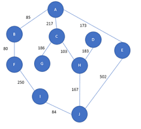

```{r setup, include=FALSE}
knitr::opts_chunk$set(echo = TRUE)
library(Rcpp)
```

## Introduction 


La théorie des graphes est une branche des mathématiques et de 
l’informatique qui consiste à modéliser différents problèmes de la vie 
réelle sous forme de graphes. L’une des utilisations les plus classiques est 
la modélisation d’un réseau routier, élèctrique entre différentes villes ; d'un reseau de transmission entre plusieurs antennes. L’une 
des problématiques principales étant l’optimisation des distances entre deux points.
Pour trouver le plus court chemin , on utilise souvent l’algorithme de Dijkstra ou encore Bellman-Ford. 
Revenons sur son fonctionnement dans cet article Voyons un exemple (tiré de Wikipedia) :

```{r pressure, echo=FALSE, fig.cap="A caption", out.width = '80%'}

```


Ici les villes A à J sont représentées par les sommets du graphe.
Elles sont reliées par des routes qui correspondent aux arêtes du graphe. À chaque arête est associée une valeur que l’on appelle le poids. Elle correspond généralement à un coût ou à une distance.
Ici, chaque poids peut être vu comme la distance entre les deux villes reliées.
Très vite se pose un problème : comment déterminer le plus court chemin entre deux sommets ?

C’est là que l’algorithme de Dijkstra intervient ! 
Comment l’algorithme Dijkstra fonctionne ?

Imaginons que l’on cherche à trouver le plus court chemin entre la ville A et la ville A.
Tout au long de l’algorithme on va garder en mémoire le chemin le plus court depuis E pour chacune des autres villes dans un tableau.

On répète toujours le même processus :

   - On choisit le sommet accessible de distance minimale comme sommet à explorer.
   - A partir de ce sommet, on explore ses voisins et on met à jour les distances pour chacun. On ne met à jour la distance que si elle est inférieure à celle que l’on avait auparavant
   - On répète jusqu’à ce qu’on arrive au point d’arrivée ou jusqu’à ce que tous les sommets aient été explorés.

C’est un peu vague tout ça …
