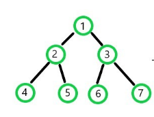

```{r setup, include=FALSE}
knitr::opts_chunk$set(echo = TRUE)
library(igraph)
library(ggplot2)
library(microbenchmark)
library(Rcpp)
```

# Sommaire

### Chargement du package

### Introduction

#### 1 - Algorithme de Bellman-Ford (solution naïve)

-   1.1 Principe de l'algorithme

-   1.2 Complexité

-   1.3 Avantages et Inconvénients

-   1.4 Pseudo code l'algorithme et exemples

#### 2 - Algorithme de Dijkstra

-   2.1 Principe de l'algorithme

-   2.2 Exemples

-   2.3 Complexité et simulation

#### Benchmark et Conclusion

## Introduction

Le chemin le plus court est un problème qui consiste à trouver la route la plus courte d'un point de départ à une destination finale. En général, pour traiter ce type de problème on utilise la théorie des graphes.
Un graphe est un objet mathématique abstrait, qui contient des nœuds connectés par des arêtes. Le long des arêtes d'un graphe, il est possible de marcher en se déplaçant d'un sommet à d'autres. On détermine si le graphe est dirigé ou non dirigé selon les directions de la marche possible. De plus, on associe un poids à chaque arrête pour modéliser le cout dans notre problème.
Ensuite, nous pouvons trouver ce problème dans plusieurs domaines comme : 

 - **Réseaux de transport** : Dans le cas d'un réseau de transport, les gares ou les aéroports peuvent être considérés comme des nœuds et les lignes de transport (trains, vols, etc.) peuvent être considérées comme des arêtes. Nous cherchons le meilleur itinéraire entre deux gares ou aéroports en basant sur le temps/ le coût de chaque.
 
 - **Réseaux de communication** : Dans le cas des réseaux de communication, les nœuds peuvent représenter les ordinateurs ou les équipements de réseau et les arêtes peuvent représenter les connexions physiques ou logiques entre les nœuds. L'algorithme peut être utilisé pour trouver le chemin le plus court entre deux nœuds en utilisant la bande passante disponible sur chaque arête pour déterminer le chemin le plus rapide pour transmettre les données.


Nous allons se concentrer sur le deuxième exemple de transmission des données. La figure ci-dessus nous donne une idée globale du fonctionnement de la communication sur Internet. Lorsque nous utilisons un navigateur pour demander une page Web à un serveur, la demande doit passer par notre réseau local et passer sur Internet via un routeur. La demande arrive finalement à un routeur du réseau local où se trouve l’information. La page web que vous avez demandée repasse ensuite par les mêmes routeurs pour arriver à votre navigateur. D'autres routeurs se trouvent à l'intérieur du nuage intitulé "Internet" dans le diagramme. Le rôle de tous ces routeurs est de travailler ensemble pour acheminer l’informations d'un endroit à l'autre.

## 1 - Algorithme de *Bellman--Ford*

### 1.1 Principe de l'algorithme

L'algorithme de *Bellman-Ford* est utilisé pour trouver les plus courts chemins dans un graphe pondéré avec **des poids négatifs**.\
Il s'agit d'une variante de l'algorithme de Dijkstra qui peut gérer des **poids négatifs**.

L'algorithme fonctionne en itérant sur tous les arcs du graphe un certain nombre de fois. Lors de chaque itération, les distances des sommets sont mises à jour en utilisant les distances des sommets voisins. Plus précisément, pour chaque **arc (u, v)** du graphe, **la distance de "v" est mise à jour si elle est plus courte que la distance de "u" plus le poids de l'arc (u, v).**

Après **n-1 itérations**, où **n** est le nombre de sommets dans le graphe, les distances des sommets seront correctes si le graphe ne contient pas de cycles de poids négatif. **Si l'algorithme effectue encore une itération et si une mise à jour est effectuée, cela signifie qu'il existe un cycle de poids négatif dans le graphe.**

En résumé, l'algorithme de *Bellman-Ford* est utilisé pour trouver les plus courts chemins dans un graphe pondéré avec des poids négatifs en itérant sur tous les arcs du graphe un certain nombre de fois et en mettant à jour les distances des sommets en utilisant les distances des sommets voisins.

### 1.2 Complexité

La complexité de l'algorithme de *Bellman-Ford* est de $O(V*E)$, où $V$ **est le nombre de sommets** dans le graphe et **E est le nombre d'arcs**.

La raison de cette complexité est que l'algorithme effectue un certain nombre d'itérations *(généralement n-1 itérations, où n est le nombre de sommets dans le graphe)* sur tous les arcs du graphe. Pour chaque itération, l'algorithme parcourt tous les arcs du graphe pour mettre à jour les distances des sommets.

Ainsi, la complexité totale de l'algorithme est $(n-1) * E$, où n est le nombre de sommets et E est le nombre d'arcs. En utilisant la notation de complexité, cela peut être exprimé comme $O(V*E)$.

Il est important de noter que cette complexité est valable pour un graphe non-dense, c'est-à-dire lorsque le nombre d'arcs est beaucoup plus petit que $V^2$.

**Dans des cas où le nombre d'arcs est proche de** $V^2$**, la complexité de l'algorithme est proche de O(**$V^3$**).**

En effet, si le nombre d'arcs est proche de $V^2$, cela signifie que pour chaque sommet il y a un nombre important d'arcs connectés, c.à.d pour chaque itération, tous les arcs seront parcourus pour mettre à jour les distances des sommets.

En utilisant la notation de complexité, cela peut être exprimé comme $O(V^2 * V) = O(V^3)$. Cela est dû au fait que l'algorithme parcours tous les arcs $E = V^2$, pour $V$ sommets, pour n-1 itérations.

### 1.3 Avantages et Inconvénients

#### Avantages

-   L'algorithme de Bellman-Ford peut gérer des poids négatifs, contrairement à l'algorithme de Dijkstra qui ne peut gérer que des poids positifs.

-   Il peut détecter les cycles de poids négatifs dans un graphe, ce qui n'est pas possible avec l'algorithme de Dijkstra.

-   Il est relativement simple à implémenter comparé à d'autres algorithmes pour trouver les plus courts chemins.

#### Inconvénients

-   Il est plus lent que l'algorithme de *Dijkstra*, lorsque les poids sont tous positifs, l'algorithme de *Dijkstra* est généralement plus rapide que *Bellman-Ford*, car il ne parcourt pas tous les arcs du graphe un certain nombre de fois.

-   Il peut être inefficace pour les graphes denses *(grand nombre d'arcs)*: lorsque le nombre d'arcs est proche de $V^2$ (où $V$ est le nombre de sommets), la complexité de l'algorithme devient $O(V^3)$, ce qui peut rendre l'algorithme inefficace pour les graphes denses.

-   Il n'est pas adapté pour les graphes de grande taille *(grand nombre de sommets)*: l'algorithme de *Bellman-Ford* peut être inefficace pour les graphes de grande taille en raison de sa complexité $O(V*E)$, donc il peut être nécessaire d'utiliser des algorithmes plus efficaces comme *Johnson's algorithm* ou *Floyd-Warshall algorithm* pour résoudre des problèmes sur des graphes de grande taille.

### 1.4 Pseudo code l'algorithme et exemples

**Pseudo Code**

    procédure BellmanFord(liste de sommets, liste d'arêtes, source)
       pour tout sommet v dans la liste de sommets
           si v est égal à la source
               alors v.distance = 0
               sinon v.distance = infini
       pour i de 1 à n-1 où n est le nombre de sommets
           pour toutes les arêtes (u, v) dans la liste d'arêtes
               si v.distance > u.distance + poids de l'arête (u, v)
                   alors v.distance = u.distance + poids de l'arête (u, v)
       pour toutes les arêtes (u, v) dans la liste d'arêtes
           si v.distance > u.distance + poids de l'arête (u, v)
               alors retourner faux
       retourner vrai
    fin

```{r echo=FALSE}
BellmanFord <- function(vertices, edges, start) {
  
  # intialisation
  n <- length(vertices)
  distance <- rep(Inf, n)
  parents <- rep(NA, n)
  
  names(distance) <- vertices
  names(parents) <- vertices
  distance[start] <- 0
  
  # relaxation des arcs
  for (i in 1:(n-1)) {
    for (j in 1:(nrow(edges))) {
      
      u <- edges$from[j]
      v <- edges$to[j]
      w <- edges$weight[j]
      
      if (distance[v] > distance[u] + w) {
        distance[v] <- distance[u] + w
        parents[v] <- u
      }
    }
  }
  
  # vérifications des cercles négatifs
  for (k in 1:(nrow(edges))) {
    
    u <- edges$from[k]
    v <- edges$to[k]
    w <- edges$weight[k]
    
    if (distance[v] > distance[u] + w) {
      # trouver le cercle négatif
      negativeLoop <- c(v, u)
      for (l in 1:(n-1)) {
        u <- negativeLoop[1]
        for (j in 1:(nrow(edges))) {

          v <- edges$to[j]
          w <- edges$weight[j]
          if (v != u) {
            if (distance[v] > distance[u] + w) {
              negativeLoop <- c(v, negativeLoop)
            }
          }
        }
      }
      cat("\nWarning! - Graph contains a negative-weight cycle!\nThe shortest path will not be efficient!\n")
    }
  }
  return(list(distance = distance, parents = parents))
}
```

```{r}
vertices <- c("r", "A", "B", "C", "D", "E", "F")
edges <- data.frame(from   = c("r", "r", "C", "C", "C", "C", "D", "E", "F", "F", "B"),
                    to     = c("A", "C", "A", "B", "D", "E", "E", "D", "E", "B", "A"),
                    weight = c(7, 1, 10, 3, 11, 3, 1, 5, 5, 4, 4))

coords <- matrix(c(2, 2, # r
                   4, 0, # C
                   6, 2, # D
                   8, 0, # E
                   6, -2, 
                   2, -2,
                   0, 0), byrow = TRUE, ncol = 2) 

g <- graph_from_data_frame(edges, 
                           directed = TRUE)

plot(g, 
     edge.label=E(g)$weight, 
     edge.label.cex=1, 
     vertex.size = 25, 
     edge.arrow.size = 0.5, 
     layout=coords)

BellmanFord(vertices, edges, "r")
```

## 2 - L'algorithm de Djikstra

### 2.1 Principe de l'algorithme

Dijkstra est un algorithme utilisé pour trouver le plus court chemin dans un graphe. Concrètement, on considère un certain nombre de noeuds et les arêtes entre eux, ainsi que la « longueur » des arêtes (appelée "poids"), l'algorithme construit le chemin le plus court entre le noeud de départ spécifié et tous les autres noeuds.

Le principe de Dijkstra (greedy algorithm) consiste à examiner itérativement le noeud présentant la plus petite distance actuelle par rapport à la source et à mettre à jour tous les voisins non encore visités si le chemin vers celui-ci via le noeud actuel est plus court. Les étapes de l'algorithme sont expliquées ci-dessous :

**1.** Initialiser la distance au noeud de départ à 0 et les autres distances à l'infini.\
**2.** Labéliser tous les nouds comme "non visité".\
**3.** Tant que nous n'ayons pas visité tous les nouds :\
- Trouver le noud avec la distance la plus courte de la source (pour le premier essaie, ce sera le noud source lui-même).\
- Pour tous les noeuds voisins que nous n'avons pas encore visités, vérifiez si la plus petite distance actuelle vers ce voisin est plus grande que si nous devions passer par le noud actuel.\
- Si c'est le cas, la plus petite distance de ce voisin est mise à jour et correspond à la distance entre la source et le noeud actuel plus la distance entre le noud actuel et ce voisin.

Le pseudo-code ci-dessous illustre les étapes de notre algorithme :

    procédure Dijkstra(liste de sommets, liste d'arêtes, source)
       initialiser un tas min vide
       pour tout sommet v dans la liste de sommets
           si v est égal à la source
               alors v.distance = 0
               sinon v.distance = infini
               ajouter v au tas min
       tant que le tas min n'est pas vide
           extraire le sommet u avec la distance minimale du tas min
           pour tout voisin v de u
               si v.distance > u.distance + poids de l'arête (u, v)
                   alors v.distance = u.distance + poids de l'arête (u, v)
                   mettre à jour v dans le tas min
    fin

```{r, echo=FALSE}
dijkstra <- function(graph_DataFrame, start_node){

  #assertions

  if(is.element(F,graph_DataFrame[[3]] >0)==TRUE){
    return(cat("\nWarning! - Edge's weight must be postive to apply Dijkstra"))}

  stopifnot(is.data.frame(graph_DataFrame) && ncol(graph_DataFrame) == 3)
  stopifnot(colnames(graph_DataFrame) == c("from", "to", "weight"))

  stopifnot((is.numeric(graph_DataFrame[[1]]) && is.numeric(graph_DataFrame[[2]]))||(is.character(graph_DataFrame[[1]]) && is.character(graph_DataFrame[[2]])))
  stopifnot((is.numeric(start_node)||is.character(start_node))&& length(start_node) == 1 && is.element(start_node, graph_DataFrame[[1]]))

  # to make it universal, changing graph_DataFrame nodes to numeric
  if(is.character(graph_DataFrame[[1]]) && is.character(graph_DataFrame[[2]])==TRUE){
    graph_DataFrame[ , 1] <- ifelse(is.numeric(graph_DataFrame[ ,1]), graph_DataFrame[ ,1], lapply(graph_DataFrame[1], as.numeric))
    graph_DataFrame[ , 2] <- ifelse(is.numeric(graph_DataFrame[ ,2]), graph_DataFrame[ ,2], lapply(graph_DataFrame[2], as.numeric))
    start_node <- as.numeric(start_node)
  }

  # Vector of nodes to check
  checkNode <- sort(unique(append(graph_DataFrame[ ,1],graph_DataFrame[ ,2])))

  # Vector holds predecessor of each node, o for the start_node and nodes that we ca not
  # visit from start_node

  parentNode <- rep(NA,length(checkNode))

  # Vector which holds distances to initial node
  distanceNode<-  rep(Inf, length(checkNode))
  names(distanceNode) <- checkNode


  distanceNode[start_node] <- 0
  while(length(checkNode) > 0){
    #find node with lowest distance from node to check

    nodeDistanceToCheck <- distanceNode[names(distanceNode) %in% checkNode]
    node <- nodeDistanceToCheck[which.min(nodeDistanceToCheck)]

    # extracting edges to be checked

    nodeEdges <- graph_DataFrame[which(graph_DataFrame[ ,1] == names(node)), ]

    # apply distances to distance vector

    if(nrow(nodeEdges) > 0){ # to avoid wells

    for (i in 1:nrow(nodeEdges)) {
      if(distanceNode[nodeEdges[i, 2]] > node + nodeEdges[i, 3]){
        distanceNode[nodeEdges[i, 2]] <- node + nodeEdges[i, 3]

        parentNode[as.integer(nodeEdges[i,2])] = as.numeric(names(node))

      }
     }
    }

    #removing current node from list of nodes to be checked

    checkNode <- checkNode[ -which(checkNode == names(node))]
  }

  solution <- list()
  solution$distance <- unname(distanceNode)
  solution$path  <- parentNode
  return(solution)
}
```

Finalement, le tableau que nous avons utilisé pour garder la trace de la plus courte distance actuelle entre la source et tous les autres nouds contiendra les distances (finales) les plus courtes. En plus, nous gardons la trace de prédécesseur de chaque nœud pour reconstruire le chemin.

### 2.2 Exemples

On cherche le plus court chemin de noeud source 3 à tous les autres dan sle graphe ci dessous:

```{r}
vertices <- 1:7
from_ <- c(3, 3, 2, 2, 2, 2, 6, 1, 7, 7, 5)
to_   <- c(4, 2, 4, 5, 6, 1, 1, 6, 1, 5, 4)  
# --- Input avec Data Frame
edges <- data.frame(from   = from_,
                    to     = to_,
                    weight = c(7, 1, 10, 3, 11, 3, 1, 5, 5, 4, 4)) 
# --- pour le graph
coords <- matrix(c(2, 2,
                   4, 0, 
                   6, 2, 
                   8, 0, 
                   6, -2, 
                   2, -2,
                   0, 0), byrow = TRUE, ncol = 2)
g <- graph_from_data_frame(edges, 
                           directed = TRUE)
plot(g, 
     edge.label=E(g)$weight, 
     edge.label.cex=1, 
     vertex.size = 25, 
     edge.arrow.size = 0.5, 
     layout = coords)
```

Start

-   On visite 3 car c'est le minimun au début de l'algo.

    Mise à jour de la distance du noeud 3 à 2

    Mise à jour de la distance du noeud 3 à 4

    supprimer 3 des Noeuds non visités: [1,2,4,5,6,7]

    Mise à jour le parent de 2 et 4

    Distances actuelles les plus petites: [Inf, 1, 0, 7, Inf, Inf, Inf]

-   On visite 2 avec la distance actuelle 1 minimale au source.

    Mise à jour de la distance du noeud 2 à 1

    Mise à jour de la distance du noeud 2 à 5

    Mise à jour de la distance du noeud 2 à 6

    la distance de 2 à 4 reste la meme pas de relaxation

    supprimer 2 des Noeuds non visités: [1,4,5,6,7]

    Mise à jour le parent de 1,5 et 6

    Distances actuelles les plus petites: [4,1,0,7,4,12,Inf]

-   On visite 5 avec la distance actuelle 4 minimale au source.

    la distance de 4 à 5 reste la meme pas de relaxation

    supprimer 5 des Nouds non visités: [1,4,6,7]

    Distances actuelles les plus petites: [4,1,0,7,4,12,Inf]

-   On visite 1 avec la distance actuelle 4 minimale au source.

    Mise à jour de la distance du noeud 1 à 6

    supprimer 1 des Noeuds non visités: [4,6,7]

    Mise à jour le parent de 6

    Distances actuelles les plus petites: [4,1,0,7,4,9,Inf]

-   On visite 4 avec la distance actuelle 7 minimale au source.

    pas de voisins

    supprimer 4 des Nouds non visités: [6,7]

    Distances actuelles les plus petites: [4,1,0,7,4,9,Inf]

-   On visite 6 avec la distance actuelle 9 minimale au source.

    la distance de 6 à 1 reste la meme pas de relaxation

    supprimer 6 des Nouds non visités: [7]

    Distances actuelles les plus petites: [4,1,0,7,4,9,Inf]

-   On visite 7 avec la distance actuelle Inf minimale au source.

    pas de relaxation

    supprimer 7 des Noeuds non visités: []

    Distances actuelles les plus petites: **[4,1,0,7,4,9,Inf]**

End

Par conséquence les distances minimales de source à tous les noeuds **[4,1,0,7,4,9,Inf]**. Rétro-propagation permet de construire les chemins. Nous vérifions ce résultat par notre algorithme implémenté auparavant.

```{r}
dijkstra(edges,3)
```

### 2.3 Complexité et simulation :

-   Min Heaps

Un Min Heap est un arbre binaire complet dans lequel les nœuds enfants ont une valeur plus élevée (moins de priorité) que les nœuds parents, c'est-à-dire que tout chemin de la racine aux nœuds feuilles a un ordre croissant d'éléments. L'image ci dessous illustre un exemple de ce type arbre.



Les opérations d'insertion et de suppression modifient d'abord le tas pour le rendre conforme à la propriété de forme, en ajoutant ou en retirant de l'extrémité de Heap. Ensuite, la propriété de Heap est restaurée en parcourant le Heap vers le haut ou vers le bas. Les deux opérations prennent un temps $O(log n)$.

Nous avons implémenté l'algorithme Dijkstra en se basant sur Min-heap. La complexité de temps d'exécution est : $O((V+E)logV)$ avec $V$ est le nombre des nœuds et $E$ est le nombre des arrêts dans un graphe connectés. En effet,

-   Soit G=(V, E,w) un graphe pondéré et représenté comme une liste d'adjacence.
-   La file d'attente prioritaire Q est représentée comme un heap binaire.

1.  Il faut un temps $O(V)$ pour construire la file d'attente prioritaire initiale de $V$sommets.
2.  Avec la représentation en liste d'adjacence, tous les sommets du graphe peuvent être traversés en utilisant BFS. Par conséquent, l'itération sur tous les voisins des sommets et la mise à jour de leurs valeurs de dist au cours d'une exécution de l'algorithme prennent $O(E)$ temps.
3.  Le temps nécessaire à chaque itération de la boucle est de $O(V)$, car un sommet est retiré de $Q$ par boucle.
4.  La structure de données du tas binaire nous permet d'extraire-min (enlever le nœud avec la dist minimale) et de mettre à jour un élément (recalculer dist[u]) en $O(logV)$ temps.
5.  Par conséquent, la complexité temporelle devient $O(V) + O(Elog|V|) + O(|V|log|V|)$, qui est $O((|E|+|V|)log|V|) = O(|E|log|V|)$.

G un graphe connecté. $E=\frac{(V-1)V}{2}$ donc E est $O(V^2)$ on pourra écrire la complexité comme $O(V^2log(V))$.

-   Simulation et implimentation :

Cette partie est dédié à simuler les deux algorithmes (Bellman Ford et Dijkstra) que nous avons implémenté sous $R$ et sous $C++$. Premièrement, on va illustrer la complexité de chaque algorithme sur des graphes générés par le modèle d'ErdosRenyi qui tire les arrêtes de manière indépendante et avec la même probabilité $p = 0.6$. Ensuite, nous allons comparer le temps calcul entre $C++$ et $R$.

D'après le calcul théorique de la partie précédente, nous avons montré que la complexité en temps d'exécution de Bellman Ford peut s'écrire comme $O(V^3)$ et Dijkstra comme $O(V^2log(V))$ avec $V$ est le nombre des noeuds dans le graphe.

Donc, la complexité est décrite dans l'échelle logarithmique par l'équation : $$\text{Bellman Ford :  } 3\times log(V))$$ $$\text{Dijkstra :  } 2log(V)+log(log(V)))$$

En plus, le modèle générative de graphe est ErdosRenyi avec une probabilité $p=0.6$,autrement dit chaque arête possible entre les sommets apparaît avec probabilité $p$, indépendamment des autres arêtes.

$G(V,0.6)$ est le graphe dont la matice adjacence $X_{i j}= \begin{cases}1 & \text { si }\{i, j\} \text { est une arête de } G, \\ 0 & \text { sinon }\end{cases}$

avec, $\mathbb{P}\left[X_{i j}=1\right]=1-\mathbb{P}\left[X_{i j}=0\right]=p$

Donc, nous gardons toujours les mêmes chances en changeant le nombre des nœuds $V\in [10,20,30,40,50,....,300]$. Nous effectuons 30 simulations pour chaque $V$, ensuite en moyennant les résultats on trouve les figues suivants :

-   Dijkstra

```{r}
mydata <- read.csv("Mydata.csv")
mydata <- mydata[, -1]

mydata_simulation <- data.frame(log_vertex=log(c(1:30)*10),log_time=log(rowMeans(mydata)))

lm_dijkstra=lm(log_time~ log_vertex,data=mydata_simulation)
lm_dijkstra$coefficients

ggplot(data=mydata_simulation, aes(x=log_vertex, y=log_time)) + geom_hline(yintercept = 0) +
  geom_vline(xintercept = 0) + geom_point(shape=17, fill="black", color="darkred", size=3)+
  stat_smooth(method = "lm",se=F) + theme_minimal()
```

### Benchmark

```{r echo=FALSE}

BellmanFordR <- function(vertices, edges, start) {
  
  # intialization
  n <- length(vertices)
  distance <- rep(Inf, n)
  parents <- rep(NA, n)
  
  names(distance) <- vertices
  names(parents) <- vertices
  distance[start] <- 0
  
  # relaxation of the edges
  for (i in 1:(n-1)) {
    for (j in 1:(nrow(edges))) {
      
      u <- edges$from[j]
      v <- edges$to[j]
      w <- edges$weight[j]
      
      if (distance[v] > distance[u] + w) {
        distance[v] <- distance[u] + w
        parents[v] <- u
      }
    }
  }
  
  # checks for negative circles
  for (k in 1:(nrow(edges))) {
    
    u <- edges$from[k]
    v <- edges$to[k]
    w <- edges$weight[k]
    
    if (distance[v] > distance[u] + w) {
      # find the negative circle
      negativeLoop <- c(v, u)
      for (l in 1:(n-1)) {
        u <- negativeLoop[1]
        for (j in 1:(nrow(edges))) {
          
          v <- edges$to[j]
          w <- edges$weight[j]
          if (v != u) {
            if (distance[v] > distance[u] + w) {
              negativeLoop <- c(v, negativeLoop)
            }
          }
        }
      }
      cat("\nWarning! - Graph contains a negative-weight cycle!\nThe shortest path will not be efficient!\n")
    }
  }
  return(list(distance = distance, parents = parents))
}

```

```{r echo=FALSE}
cppFunction('
Rcpp::List bellmanFordRcpp(Rcpp::NumericMatrix adjacencyMatrix, int source){

  int n = adjacencyMatrix.nrow();
 
  Rcpp::NumericVector distance(n);
  Rcpp::IntegerVector predecessor(n);

  for (int i = 0; i < n; i++) {
    distance[i] = R_PosInf; 
    predecessor[i] = -1; 
  }

  distance[source] = 0; 

 
  for (int i = 1; i <= n-1; i++) {
    for (int u = 0; u < n; u++) { 
      for (int v = 0; v < n; v++) { 
      
        if (adjacencyMatrix(u,v) > 0) { 

          double alt = distance[u] + adjacencyMatrix(u,v); 

          if (alt < distance[v]) { 
            distance[v] = alt;   
            predecessor[v] = u;  
          }                      

        }                        

      }                        

    }                        

  }                        
  
  return Rcpp::List::create(_["distance"]=distance, _["predecessor"]=predecessor +1 );  
}
'
)
```

```{r echo=FALSE}
cppFunction('
void dijkstraRcpp(NumericMatrix graph, int source, int dest) { 
    int D = dest;
    dest = dest-1;
    int V = graph.nrow();
    source = source - 1;
    
    NumericVector dist(V); 

      
    LogicalVector visited(V);  

     
    for (int i = 0; i < V; i++) { 

        dist[i] = INT_MAX; 
        visited[i] = false;  
    }  
   
    dist[source] = 0;       

    for (int count = 0; count < V - 1; count++) {    

        int min = INT_MAX, min_index;    

        for (int v = 0; v < V; v++)     {        

            if (visited[v] == false && dist[v] <= min)         {            

                min = dist[v];            

                min_index = v;         
            }     
        }     
           
        visited[min_index] = true;      
             
        for (int v = 0; v < V; v++)      {         
            if (!visited[v] && graph(min_index, v) && dist[min_index] != INT_MAX && dist[min_index]+graph(min_index , v) < dist[v])          {             
                dist[v] = dist[min_index] + graph(min_index,v);         
                }      
        } 
    }   
        
    

   
    if(dest!=source and dist[dest]!=INT_MAX){
        std::vector<int> path ; 
        
        path.push_back(dest); 
        while(dest!=source){ 
            for(int i=0 ; i<V ; i++){ 
                if(graph(i,dest) !=0 && dist[dest] - graph(i,dest) == dist[i]){ 
                    path.push_back(i); 
                    dest = i ; 
                    break; 
                    }
                } 
        }
        
        Rcpp::Rcout<<"Le plus court chemin entre "<<source + 1<<" et "<< D  <<" est : "; 
        while (!path.empty()) { 
            Rcpp::Rcout<<path.back() + 1 <<"  "; 
        
            path.pop_back();
        }
        Rcpp::Rcout<< " et distant de : "<<dist[D]<<std::endl;
        
    }
    if(dist[dest] == INT_MAX){
        Rcpp::Rcout<<"pas de chemin possible entre "<< source + 1 <<" et " << dest ;
    }
    
    return ;
    
    
    
} 
')
```

```{r echo=FALSE}
dijkstraR <- function(graph_DataFrame, start_node){

  #assertions

  if(is.element(F,graph_DataFrame[[3]] >0)==TRUE){
    return(cat("\nWarning! - Edge's weight must be postive to apply Dijkstra"))}

  stopifnot(is.data.frame(graph_DataFrame) && ncol(graph_DataFrame) == 3)
  stopifnot(colnames(graph_DataFrame) == c("from", "to", "weight"))

  stopifnot((is.numeric(graph_DataFrame[[1]]) && is.numeric(graph_DataFrame[[2]]))||(is.character(graph_DataFrame[[1]]) && is.character(graph_DataFrame[[2]])))
  stopifnot((is.numeric(start_node)||is.character(start_node))&& length(start_node) == 1 && is.element(start_node, graph_DataFrame[[1]]))

  # to make it universal, changing graph_DataFrame nodes to numeric
  
  if(is.character(graph_DataFrame[[1]]) && is.character(graph_DataFrame[[2]])==TRUE){
    graph_DataFrame[ , 1] <- ifelse(is.numeric(graph_DataFrame[ ,1]), graph_DataFrame[ ,1], lapply(graph_DataFrame[1], as.numeric))
    graph_DataFrame[ , 2] <- ifelse(is.numeric(graph_DataFrame[ ,2]), graph_DataFrame[ ,2], lapply(graph_DataFrame[2], as.numeric))
    start_node <- as.numeric(start_node)
  }

  # Vector of nodes to check
  checkNode <- sort(unique(append(graph_DataFrame[ ,1],graph_DataFrame[ ,2])))

  # Vector holds predecessor of each node, o for the start_node and nodes that we ca not
  # visit from start_node

  parentNode <- rep(NA,length(checkNode))

  # Vector which holds distances to initial node
  
  distanceNode<-  rep(Inf, length(checkNode))
  names(distanceNode) <- checkNode


  distanceNode[start_node] <- 0
  while(length(checkNode) > 0){
    #find node with lowest distance from node to check

    nodeDistanceToCheck <- distanceNode[names(distanceNode) %in% checkNode]
    node <- nodeDistanceToCheck[which.min(nodeDistanceToCheck)]

    # extracting edges to be checked

    nodeEdges <- graph_DataFrame[which(graph_DataFrame[ ,1] == names(node)), ]

    # apply distances to distance vector

    if(nrow(nodeEdges) > 0){ # to avoid wells

    for (i in 1:nrow(nodeEdges)) {
      if(distanceNode[nodeEdges[i, 2]] > node + nodeEdges[i, 3]){
        distanceNode[nodeEdges[i, 2]] <- node + nodeEdges[i, 3]

        parentNode[as.integer(nodeEdges[i,2])] = as.numeric(names(node))

      }
     }
    }

    #removing current node from list of nodes to be checked

    checkNode <- checkNode[ -which(checkNode == names(node))]
  }

  solution <- list()
  solution$distance <- unname(distanceNode)
  solution$path  <- parentNode
  return(solution)
}

```

```{r echo=FALSE}
cppFunction('
/* [[Rcpp::export]] */

List dijkstraC(NumericMatrix adjacency_matrix, int source) { 
  
  int n = adjacency_matrix.nrow();                                            // nombre de sommets 
  NumericVector distances(n);                                                 // vecteur des distances 
  IntegerVector predecessors(n);                                              // vecteur des prédécesseurs 

                                                                              // Initialisation des distances et des prédécesseurs 
  for (int i = 0; i < n; i++) { 
    distances[i] = INFINITY;                                                   // distance initiale à l infini pour tous les sommets sauf la source  
    predecessors[i] = -1;                                                     // pas de prédécesseur pour tous les sommets sauf la source  
  }                                                 
                                                  
  distances[source] = 0;                                                      // distance à 0 pour le sommet source  

  std::vector<bool> visited(n, false);                                        // vecteur des sommets visités (initialisés à false)                                        
  while(true){
    int min = INT_MAX; // indice du sommet avec la plus petite distance parmi ceux non visités  
    int min_index = -1;
    for (int i = 0; i < n; i++) {  

      if (!visited[i] && (distances[i] <= min)) {  
        
        min = distances[i] ;  
        min_index = i;
      }  

    }  
    if (min_index == -1) {  

      break;                                                                  // tous les sommets ont déjà ete visités, on sort de la boucle while.    

    } 

    visited[min_index] = true;                                                // on marque le sommet comme visité    

    for (int i = 0; i < n ; i++) {    

      if (!visited[i] && adjacency_matrix(min_index,i) && distances[min_index] != INFINITY && distances[min_index] + adjacency_matrix(min_index,i) < distances[i]) {    
      
        distances[i] = distances[min_index] + adjacency_matrix(min_index,i);      
        predecessors[i] = min_index;
        
      }
    }
  }
    return List::create(_["dist"]=distances, _["parent"]=predecessors +1);   
  }  
')

```

#### Test des différentes fonctions en R et en Rcpp

-   Données

```{r}
graph_DataFrame <-
  data.frame(from=c("1","6","2","2","2","2","7","7","5","3","3"),
           to=c("6","1","1","6","5","4","1","5","4","4","2"),
           weight=c(5,1,3,11,3,10,5,4,4,7,1))

matriceAdjacence = t(matrix(data = c(0  , 0  ,  0  ,  0  ,  0  ,    5  , 0,
                                   3  , 0  ,  0  ,  10 ,  3  ,   11  , 0,
                                   0  , 1  ,  0  ,  7  ,  0  ,   0   , 0,
                                   0  , 0  ,  0  ,  0  ,   0 ,    0  , 0,
                                   0  , 0  ,  0  ,  4  ,  0  ,    0  , 0,
                                   1  , 0  ,  0  ,  0  ,  0  ,    0  , 0,
                                   5  , 0  ,  0  ,  0  ,  4  ,    0  , 0), nrow  = 7))
matriceAdjacence

```

```{r warning=FALSE, include=FALSE}
tm <- microbenchmark(BellmanFordR(c("1", "2", "3", "4", "5", "6", "7"), graph_DataFrame, "3"),
                     bellmanFordRcpp(matriceAdjacence, 2),
                     dijkstraC(matriceAdjacence, 2),
                     dijkstraRcpp(matriceAdjacence, 2, 5),
                     dijkstraR(graph_DataFrame,"3"))
```

```{r}
autoplot(tm)
```

### Interpretation

-   Il faut noter que les versions en Rcpp sont appriori plus rapide que les versions en R.\
-   La version R de Bellman-Ford est plus rapide que la version R de Dijkstra\
-   Les versions Rcpp de Bellman-Ford et Dijkstra sont rélativement équivalente avec quelques microsecondes en moins pour Dijkstra.
